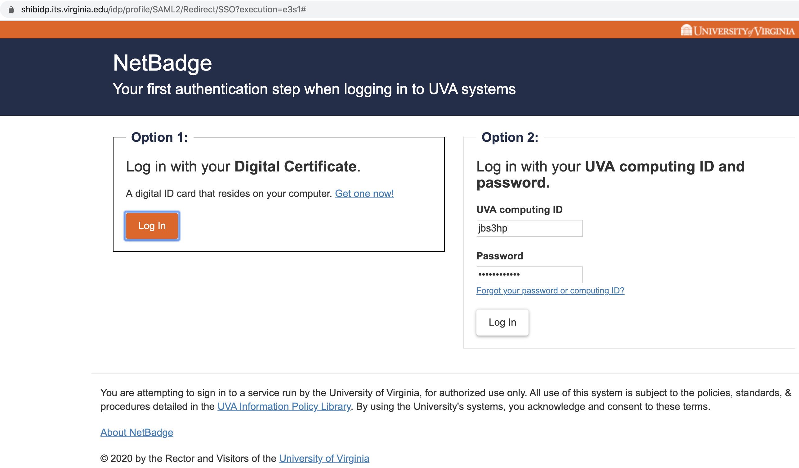
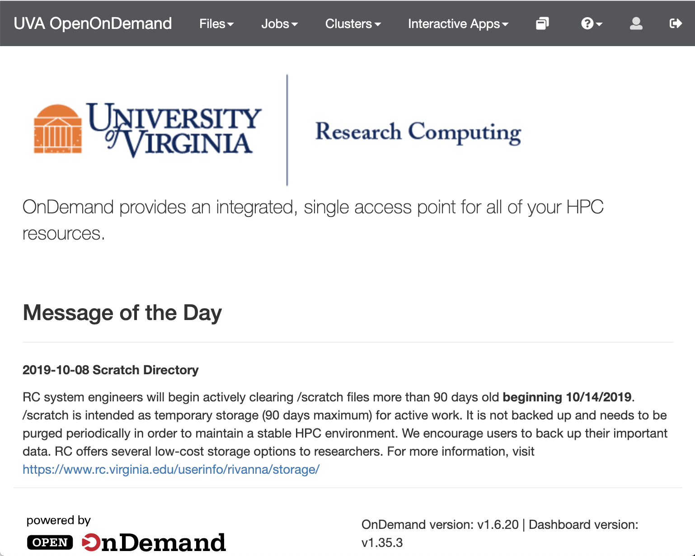

# Programming in an HPC

All computing and software development for DSPG will occur in [Rivanna](https://rivanna-portal.hpc.virginia.edu/pun/sys/dashboard). Open OnDemand is a graphical user interface that allows access to Rivanna via a web browser. Within the Open OnDemand environment users have access to a file explorer; interactive applications like JupyterLab, RStudio Server & FastX Web; a command line interface; and a job composer and job monitor.

- Navigate to [https://rivanna-portal.hpc.virginia.edu/pun/sys/dashboard](https://rivanna-portal.hpc.virginia.edu/pun/sys/dashboard) in a browser (e.g., Google Chrome).

!!! tip

    It is a good idea to bookmark the uniform resource locator (URL) for the Rivanna Open On Demand dashboard.
    

- Log-in throught NetBadge using your computing ID and password or a digital certificate in your device.

