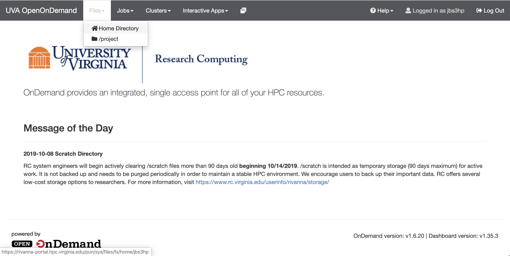
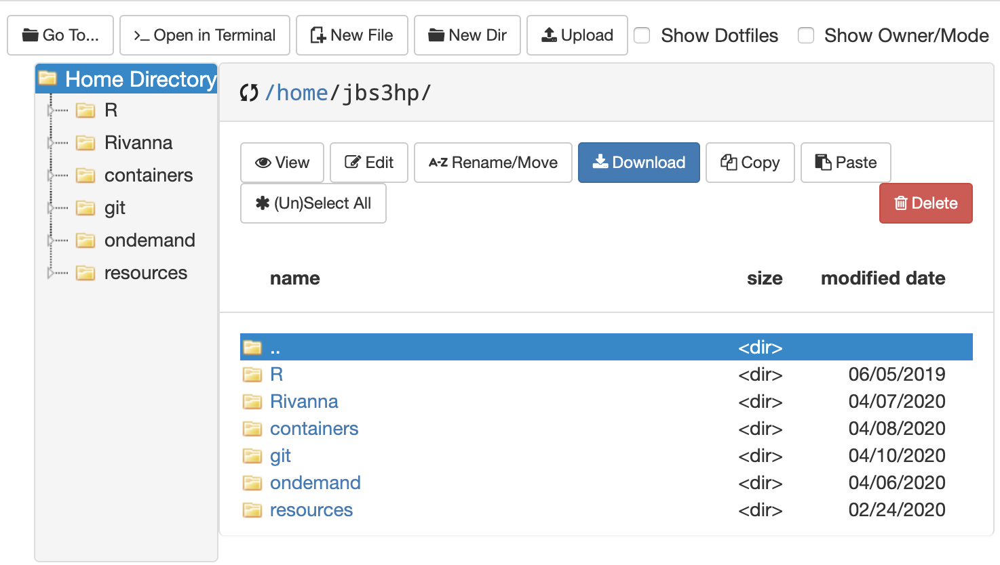

# The File Explorer

## Your Home Directory

Select the File Explorer dropdown menu and click the `Home Directory`.




This is your home directory.



!!! tip

    Your home directory is only accessible to you (i.e., you and superusers). Credentials such as API keys or credentials to the database can be passed as environmental variables.

!!! tip

    I recommend following a schema like `~/git/{project_code}/{repository}`.

!!! warning

    You should not be storing data in your home directory. Your home directory has only 50GB of storage and if an user over over the limit it will lose access to scheduling jobs until the storage is below the limit again. Projects data should be stored under the project directory.

## Project Data

Project data for the DSPG projects will be stored under: `/project/biocomplexity/sdad/projects_data/{sponsor_code}/{project_code}`.

For example, the National Center for Science and Engineering Statistics (NCSES) project on Measuring the Scope and Impact of Open Source Software has the project path: `/project/biocomplexity/sdad/projects_data/ncses/oss`. There will be at least two directories:

- `original`
- `working`

`*/original` will have a directory for each data provider/source and the raw data (e.g., `big_files.zip`). Depending on the project, the data might be stored in the database.

!!! tip

    When creating a repository for a project. You would likely want to have a `/data` directory where you can create a symbolic link to the actual data.
    ```
    ln -s /project/biocomplexity/sdad/projects_data/{sponsor_code}/{project_code} path/to/repository/data
    ```

!!! tip

    When uncompressing big files, do so to your scratch space. Every user has 10TB of space for short term storage at: `scratch/{computing_id}`. That can be a place to store temporarly the uncompressed data for uploading to the database.

!!! info

    If a sponsor is providing big files for a project. Have the project lead contact `ads7fg`, `nak3t` or `jbs3hp` for uploading the data through [Globus](https://www.globus.org/).
