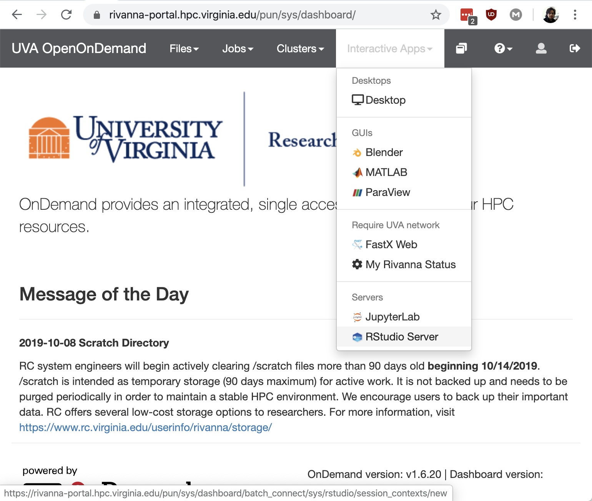
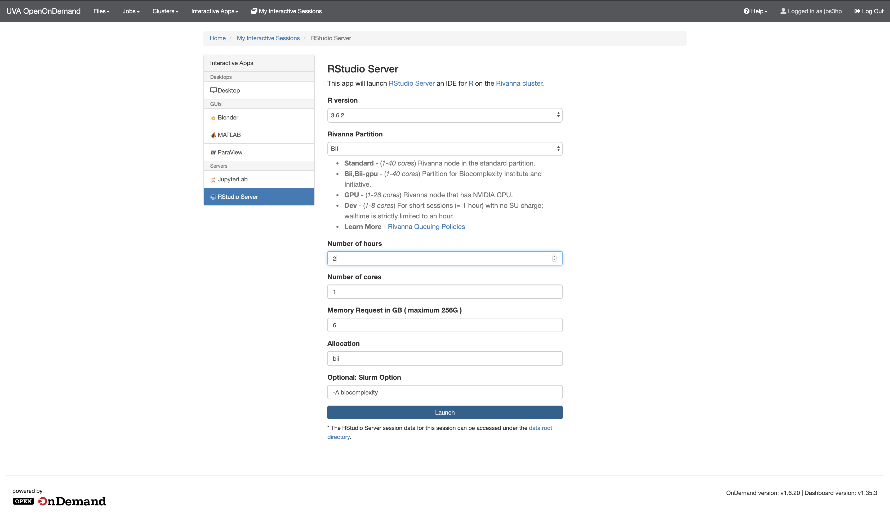
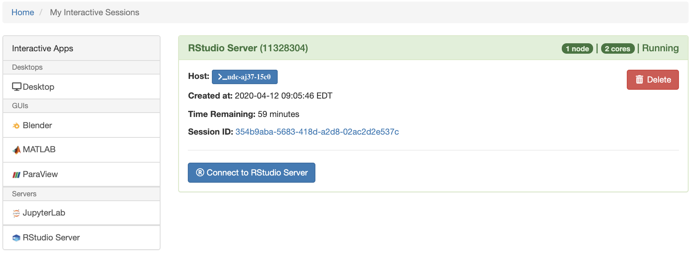

# Interactive Apps

- Click on Interactive Apps and select the one you would like. In this case the RStudio Server.

- The graphical user interface (GUI) provides a way to select the arguments for the Slurm interactive job.

A Slurm job usually take the following arguments:

  - Is is interactive? (e.g., `ijob`)
  - An account? (e.g., `-A biocomplexity` for selecting the BII account)
  - A partition: (e.g., `-p bii` for selecting the BII partition)
  - Number of cores (e.g., `-c 6` for selecting six cores)
  - Memory (e.g., `--mem=6G` for requesting 6 GB of memories to be distributed among the different cores)

The GUI allows to select some of the arguments through a dropdowns and fill-in the blank.

For the BII partition, valid numbers for the RStudio Server interactive app are:

- Time \[1, 168\] (integer values for hours)
- Number of cores \[6, 40\] (integer values)
- Memory \[6, 256\] (integer values in GB)

!!! warning

    The account information must be provided in the **Allocation** field. Leaving it blank will default to an allocation which may deplete the computing hours of allocation intended for managing permissions. DSPG fellows and interns should use `biocomplexity` or `bii_sdad` for the allocation field in the form unless there is specific account for the related project.

!!! warning

    The `Optional: Group` field must include the Linux Group for the project associated with that session. For example, for a session relating the Open-Source Software project, I should specify `bii_sdad_ncses_oss`. Contact your team leader for the Linux group associated to your project. Leaving it blank may cause permission issues when accessing project related directory/files.

!!! note

    The RStudio Server interactive session menu allows to specify the Slurm module to load (i.e., the R version). DSPG fellows and interns should select `v3.6.2`.

When all the options have been specified. Press **Launch** to queue the Slurm job.

Once the resources have been allocated to the job it will start running. You can connect to the application by clicking on the Connect to RStudio Server.

!!! tip

    You can always inspect your current interactive jobs under the `My Interactive Sessions` tab in the dashboard. Alternatively, on the dashboard, by clicking on the `Jobs` dropdown menu, you can select the `Active Jobs` to get the status and information of all your jobs (i.e., interactive or non-interactive for your account).
